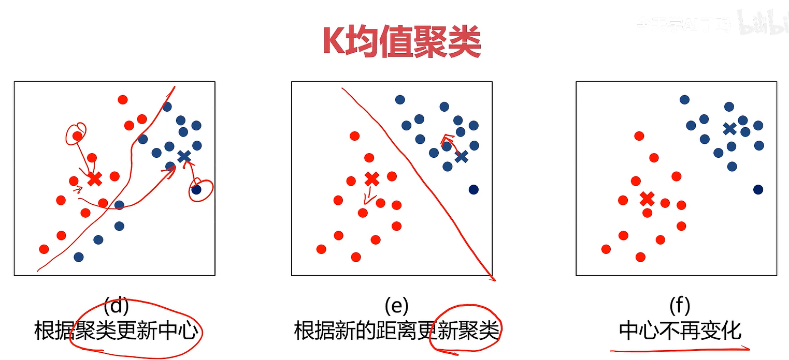

## 基礎工具包 : Panda/Numpy/Matplotlib
---
* Panda：強大的分析結構化數據工具集，可用於快速實現數據導入/出、索引。   
* Numpy：使用python進行科學計算的基礎軟件包。核心 : 基於N維數組對象ndarray的數組運算。   
* Matplotlib：python基礎繪圖庫，幾行程式碼即可生成繪圖，任何圖形都可以。(繪圖工具包)   

使用指令 `pip install (工具包) -i (下載源)` 可以加快下載速度。   
## 機器學習
---
機器學習是一種實現人工智慧的方法。從數據中尋找規律、建立關係、根據建立的關係去解決問題。   
* 實現機器學習的基本框架 : 將訓練數據餵給電腦，電腦自動求解數據關係，在新的數據上做出預測或給出建議。
* 機器學習的類別:
  * 監督學習(Supervised Learning)：訓練數據包括正確的結果(標籤-label)。EX：人臉辨識、語音翻譯、醫學診斷
  * 非監督學習(Unsupervised Learning)：訓練數據不包括正確的結果，沒有給定事先標記過的訓練示例，自動對輸入的數據進行分類或分群。EX：新聞分類
  * 半監督學習or混合學習(Semi-supervised Learning)：訓練數據包括少量正確的結果。
  * 強化學習(Reinforcement Learning)：根據每次結果收獲的獎懲(feedback)進行學習，實現優化。EX：AlphaGo

專家系統：if-then對答式。   

---
## 監督式學習
### 回歸分析
根據數據，確定兩種或兩種以上變量間相互依賴的定量關係。   
* 回歸
  * 變數
    * 一元回歸：y = f(x)
    * 多元回歸：y = f(x1, x2 ... xn)
  * 函數關係
    * 線性回歸：y = ax + b
    * 非線性回歸： y = ax^2 + bx + c

EX：房價 = f(面積)   

---
### 線性回歸
回歸分析中，變量與因變量存在線性關係。   
EX：距離S = 速度 * t + S0 (線性回歸)   
EX：距離S = 加速度 * t^2 + S0 (非線性回歸)   

---
### KNN (K近鄰分類模型)
給定一個訓練數據集，對新的輸入實例，在訓練數據集中找到與該實例最鄰近的K個實例(鄰居)，這K個實例的多數屬於某個類，就把該輸入實例分類到這個類中。   
Code example：
```
from sklearn.neighbors import KNeighborsClassifier
model = KNeighborsClassifier(n_neighbors = 3)
model.fit(x, y)
```   

---
### 梯度下降法
尋找極小值的一種方法。通過向函數上當前點對應梯度(或者是近似梯度)的反方向的規定步長距離點進行迭代搜索，直到在極小點收斂。   
   

---
### 評估模型表現
y與yˊ的均方誤差(Mean Square Error 或 MSE)、R方值(R^2)   
MSE越小越好，R^2分數越接近1越好。   
MSE：
  * 是各測量值誤差的平方和取平均值的平方根。
  * 可以評價數據的變化程度。
  * 數學特性很好，使計算梯度變得更容易。

(又被稱為 L2 損失 或 L2範數損失/平方損失)   
Code example：   
```
# evalute the model
from sklearn.metrics import mean_squared_error, r2_score
mse = mean_squared_error(y, y_pred)    # y是原本的結果，y_pred是預測結果
r2 = r2_score(y, y_pred)
print(mse, r2)
```   
使用 sklearn.metrics 的 accuracy_score 評估準確度，越接近1越準確。   
Code example：   
```
from sklearn.metrics import accuracy_score
accuracy = accuracy.score(y, y_pred)  # y是原本的結果，y_pred是預測結果
print(accuracy)
```
**侷限性**：無法真實反映模型針對各個分類的預測準確度   

---
### Scikit-learn
Python語言中專門針對機器學習應用而發展起來的一款開源框架，可以實現數據預處理、回歸、降維、模型選擇等常用的機器學習算法。   
官方網站：[Scikit-learn](https://scikit-learn.org/stable/)，裡面也有介紹一些機器學習的知識。   

---
### 邏輯回歸
用於解決分類問題的一種模型。根據數據特徵或屬性，計算其歸屬於某一類別的概率P(x)，根據概率數值判斷其所屬類別。主要應用場景：二分類問題。   
數學表達式(sigmoid方程)：   
   
   
邏輯回歸結合多項式邊界函數可解決複雜的分類問題。   


由線性回歸到邏輯回歸可以發現，很多分類問題最核心的點就是把它的決策邊界(Decision Boundary)找出來。2維就是一條線、3維就是一個平面或是球型都有可能。   

---
## 非監督式學習
優點：
  * 算法不受監督訊息(偏見)的約束，可能考慮到新的訊息。
  * 不需要標籤數據，極大程度擴大數據樣本。

主要應用：
  * 聚類分析 (clustering)：又稱為群分析，根據對象某些屬性的**相似度**，將其自動化分為不同類別。也就是給它一堆數，它可以自動把類別聚出來。
  * 關聯規則：給它一堆數，它可以自動找到相互關係。
  * 維度縮減：減少數據量，運算更高效。

---
### KMeans聚類
甚麼是KMeans Analysis (K均值聚類)?   
K-均值算法：以空間中k個點為中心進行聚類，對最靠近他們的對象歸類，是聚類算法中最為基礎但也最為重要的算法。   
* 根據數據與中心點距離畫分類別
* 基於類別數據更新中心點
* 重複過程直到收斂

特點：   
1. 實現簡單、收斂快
2. 需要指定類別數量

流程：   
   
   
Code example：   
```
from sklearn.cluster import KMeans
model = KMeans(n_clusters = 3, random_state = 0)    # n_clusters就是想分成幾類，random_state是讓初始化結果保持一致
model.fit(x)
```   
獲取模型確定的中心點：
```
centers = model.cluter_centers
```

---
### 均值飄移聚類 (Meanshift)
一種基於密度梯度上升的聚類算法(沿著密度上升方向尋找聚類中心點)   
* 在中心點一定區域檢索數據點
* 更新中心
* 重複流程到中心點穩定

特點：
1. 自動發現類別數量，不需要人工選擇
2. 需要選擇區域半徑

自動計算帶寬 (區域半徑)   
```
from sklearn.cluster import MeanShift, estimate_bandwidth
bandwidth = estimate_bandwidth(x, n_samples = 500)
# build and train the model
model = MeanShift(bandwidth = bandwidth)
model.fit(x)
```


---
### DBSCAN算法 (基於密度的空間聚類算法)
* 基於區域點密度篩選有效數據
* 基於有效數據向周邊擴張，直到沒有新點加入

特點：
1. 過濾噪音數據 (比較不相干的數據)
2. 不需要人為選擇類別數量
3. 數據密度不同時影響結果

---
### 決策樹
一種對實例進行**分類**的**樹型結構**，通過**多層判斷**區分目標所屬類別。本質：通過多層判斷，從訓練數據集中歸納出一組分類規則。   
   
優點：   
* 計算量小，運算速度快
* 易於理解，可清晰查看各屬性的重要性

缺點：   
* 忽略屬性間的相關性
* 樣本類別分布不均勻時，容易影響模型表現

問題核心：特徵選擇，每一個節點，應該選用哪個特徵。   
三種求解方法：ID3、C4.5、CART   

---
### 異常檢測
根據輸入數據，對不符合預期模式的數據進行辨識。   
   
概率密度：此函數是一個描述隨機變量在某個確定的取值點附近的可能性的函數。

---
### 數據降維
是指在某些限定條件下，降低隨機變量個數，得到一組"不相關"主變量的過程。   
作用：
* 減少模型分析數據量，提升處理效率，降低計算難度
* 實現數據可視化

**主成分分析 (PCA)**：Principal Components Analysis，數據降維技術中，應用最多的方法。   
目標：尋找 k (k < n) 維新數據，使它們反映事物的主要特徵。   
核心：在訊息損失盡可能少的情況下，降低數據維度。   
如何保留主要訊息：投影後的不同特徵數據盡可能分得開 (不相關)。    

---
## 模型評價與優化
### 過度擬合
原因：
* 模型結構過於複雜 (維度過高)
* 使用了過多屬性，末行訓練時包含了干擾項訊息

解決方法：
* 簡化模型結構 (使用低階模型，比如線性模型)
* 數據預處理，保留主成分訊息 (PCA處理)
* 在模型訓練時，增加正則化項 (regularization)

---
### 分離數據與測試數據
1. 把數據分成兩部分：訓練集、測試集
2. 使用訓練集數據進行模型訓練
3. 使用測試集數據進行預測，更有效的評估模型對於新數據的預測表現


## 參考資料
* [什麼是均方誤差(MSE)](https://staruphackers.com/%E4%BB%80%E9%BA%BC%E6%98%AF%E5%9D%87%E6%96%B9%E8%AA%A4%E5%B7%AE-mean-square-error-mse%EF%BC%9F/)
* [決策樹常見的三種算法](https://roger010620.medium.com/%E6%B1%BA%E7%AD%96%E6%A8%B9-decision-tree-%E5%B8%B8%E8%A6%8B%E7%9A%84%E4%B8%89%E7%A8%AE%E7%AE%97%E6%B3%95-id3-c4-5-cart-54091ca85044)